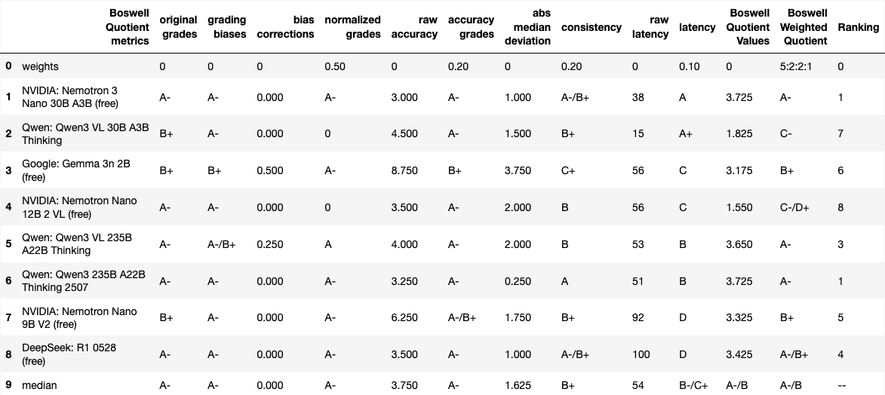

# boswell
Extends Alan Wilhelm’s [*botwell/archive/botwell_test.py*](https://github.com/alanwilhelm/botwell/tree/main/archive) for fast multi-LLM response collection via *OpenRouter*. Automatically scores answers using the unbiased (or normalized) Boswell Quotient (accuracy, consistency, speed), assigns A+–F letter grades, and generates ranked, styled result tables exported as high-quality PNGs.  A typical multi-LLM query on *OpenRouter* run for 10 LLM's cost around $2.00. 

Recommended python environment:  
&nbsp;&nbsp;&nbsp;&nbsp;&nbsp; python version >= __3.10__  
&nbsp;&nbsp;&nbsp;&nbsp;&nbsp; pandas version >= __2.1__  
&nbsp;&nbsp;&nbsp;&nbsp;&nbsp; dataframe_image version >= __0.2.7__  

Best to create a new virtual environment:  
Anaconda:
1) __$ conda create -n py310 python=3.10__&nbsp;&nbsp;&nbsp;&nbsp;&nbsp; #  or higher (at this writiing, 3.10 is most stable for data-science related packages)
2) __$ conda activate py310__
3) __$ conda install pandas numpy matplotlib ipython seaborn ipython jupyter scipy__
4) __$ pip install dataframe_image selenium__&nbsp;&nbsp;&nbsp;&nbsp;&nbsp; # use __pip__ for *PyPI* packages

initial Checkin files:
1) *boswell_test.py*&nbsp;&nbsp;&nbsp;&nbsp;&nbsp;#  slight enhancements of Alan's original [*botwell_test.py*](https://github.com/alanwilhelm/botwell/tree/main/archive); in particular, dynamic model selections among the latest available in *OpenRouter*
2) *LetterGrade.py*&nbsp;&nbsp;&nbsp;&nbsp;&nbsp;#  slight improvement of [*LetterGrade checkin*](https://github.com/p2rk2h/LetterGrades)  
3) *boswellQuotientTable.py*&nbsp;&nbsp;&nbsp;&nbsp;&nbsp;#  tabulates the original grades assigned by LLMs; calculates normalized grades for standardized comparison;
generates a Boswell Quotient table with custom-assigned weights for comprehensive evaluation; all three tables, raw grades, normalized grades, and weighted quotients, are styled and exportable as PNG files for clear visualization and reporting.
4) *domains/sample_boswell_query.py*&nbsp;&nbsp;&nbsp;&nbsp;&nbsp;#  a sample query template that expands grading prompts that now support mixed LetterGrades (e.g., A-/B+, B-/C+) for more nuanced evaluation; to create a new query, simply duplicate this template and save it under a new filename, and then update the User Prompt section with specific query or instructions, ensuring consistency while allowing full flexibility for tailored use cases.
5) *results/.../grades_table.csv*&nbsp;&nbsp;&nbsp;&nbsp;&nbsp;#  raw evaluation grades generated by *boswell_test.py* when assessing domain-specific *sample_boswell_query.py*; this file captures peer-reviewed grades assigned by chatbots to each other’s responses, all routed through *OpenRouter*, serving as a quantitative benchmark for comparing chatbot effectiveness, response quality, and relative performance.
6) *results/.../timing_report.md*&nbsp;&nbsp;&nbsp;&nbsp;&nbsp;#  this file contains performance metrics and timing data generated by running *boswell_test.py* on domain-specific *sample_boswell_query.py*. Response times and latency statistics for queries routed through *OpenRouter* offer insights into the efficiency and scalability of the system.

Sample usage:
1) __$ conda activate py10__  #  or equivalent
2) __$ export OPENROUTER_API_KEY='your-api-key'__  #  *OpenRouter* api key is in *https://openrouter.ai/settings/keys* after login
3a) __$ python boswell_test.py -d sample_boswell_query__  #  __-d__ specifies the query file at *domains/sample_boswell_query.py* 
&nbsp;&nbsp;&nbsp;&nbsp;&nbsp;&nbsp;&nbsp;&nbsp;&nbsp;&nbsp; #  the resulting *OpenRouter* output, *grades_table.csv* and *timing_report.md*, are 
&nbsp;&nbsp;&nbsp;&nbsp;&nbsp;&nbsp;&nbsp;&nbsp;&nbsp;&nbsp; #  automatically saved to the *./results/(timeStamp)-sample_boswell_query/* directory; for example, a 
&nbsp;&nbsp;&nbsp;&nbsp;&nbsp;&nbsp;&nbsp;&nbsp;&nbsp;&nbsp; #  sample run with time stamp *20251129-082317* stores files in *./results/20251129-082317-sample_boswell_query/*
3b) __$ python boswell_test.py -f -d sample_boswell_query__  #  __-f__ specifies only using free models currently availabe from OpenRouter with maximum 16 free models allowed.
4) __$ python boswellQuotientTable.py -d ./results/20251129-082317-sample_boswell_query -w '5:3:1:1'__   
&nbsp;&nbsp;&nbsp;&nbsp;&nbsp;&nbsp;&nbsp;&nbsp;&nbsp;&nbsp; #  __-d__ specifies the time-stamped directory and __-w__ allows custom weights to be applied; 
&nbsp;&nbsp;&nbsp;&nbsp;&nbsp;&nbsp;&nbsp;&nbsp;&nbsp;&nbsp; #  the resulting png files are saved to the same directory. 

Present limitations:
1) the Boswell framework currently evaluates chatbot performance using four key quotients:
* Normalized Grades – Standardized scores for direct comparison across responses.
* Accuracy – Measures deviation of normalized grades from the ideal benchmark (A+), quantifying alignment with expected performance.
* Consistency – Assesses the variance in peer-assigned normalized grades, reflecting reliability across evaluations.
* Latency – Computed as $$\left(1 - \frac{\text{chatbotTotalTime}}{\text{max\\_ChatbotTotalTimes}}\right) \times 100$$, representing response efficiency relative to the slowest performer.
2) domains are currently hard-wired to be within AVAILABLE_DOMAINS in *boswell_test.py*
3) dynamic chatbot (or model) selections are currently limited to the top well-known 12 AI companies, hard-wired as ALLOWED_PROVIDERS in *boswell_test.py*
4) both *boswell_test.py* and *boswellQuotientTable.py* would benefit from code refactoring to improve over all code quality:
* User Interface: Improve argument options for better usability and flexibility.
* Modularity: Separate concerns into reusable functions or classes.
* Readability: Enhance clarity with consistent naming conventions and documentation.
* Maintainability: Reduce redundancy and simplify logic for easier updates.
* Scalability: Optimize performance and adaptability for future extensions.
5) dynamic free chatbot (or model) celections are currently limited to maximum 16 models.

New updates (2025-12-14):
1) Dynamic Model Discovery: Added -f / --free flag automatically fetch the 16 most recent free models from OpenRouter.
2) Robust Data Cleaning: Updated boswellQuotientTable.py to automatically exclude any models with more than 50% missing feedback, ensuring statistical significance in the final reports.
3) Precision Refinement: Resolved column index reference errors and implemented a secondary analysis filter to sanitize remaining N/A grades before calculation.

New Summary Supersedence and Automation (2026-02-10):
1) Streamlined Execution: Added -latest flag to automatically identify and target the most recent domain file within the domains directory.
2) Architectural Shift: Summary Supersedence and Expert Synthesis: Transitioned from grading individual essays to grading Integrated Summaries. Models now act as expert analysts, synthesizing all peer responses into a single meta-analysis.
3) Analytical Depth Evaluation: Peer-grading is now performed on these syntheses to more accurately measure a model’s reasoning and summarization capabilities.
4) End-to-End Automation: Integrated an automatic trigger for boswellQuotientTable.py at the end of the query cycle for immediate visualization of performance metrics (Quality/Cost/Latency).

New updates (2026-02-24):
1) Enhanced boswellQuotientTable.py: Added a new ranking column based on the numerical median of weighted Boswell Quotients, enabling clearer performance comparisons across models.
2) Latest Sample Run Results (2026-02-23 11:14:53):
 - Query Source: domains/sample_boswell_query.py
 - Models Tested: 8 free-tier LLMs via OpenRouter:
  * NVIDIA: Nemotron-3-Nano-30B-A3B, Nemotron-Nano-12B-2-VL, Nemotron-Nano-9B-V2
  * Qwen: Qwen3-VL-30B-A3B-Thinking, Qwen3-VL-235B-A22B-Thinking, Qwen3-235B-A22B-Thinking-2507
  * Google: Gemma-3n-2B
  * DeepSeek: DeepSeek-R1-0528
3) Visualization: The resulting Boswell Quotient Table with Ranking (or results/20260223-111453-sample_boswell_queryFr/BoswellQuotientTableOutput5221.png) is ahown below:

